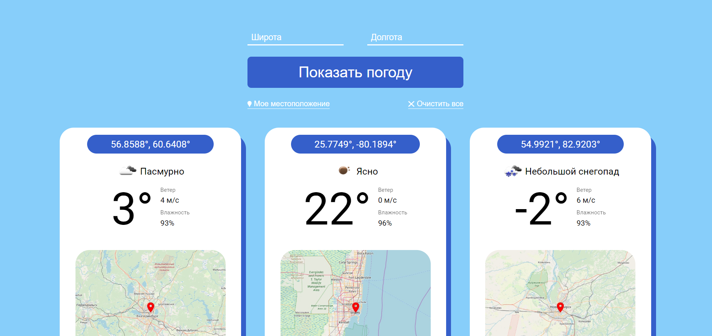

# Задание 7 недели [Abanking Education](https://education-student.abanking.ru/).
### Простое приложение "Погода".
- Приложение можно попробовать по [ссылке](https://fweather.web.app/).

- Мой макет в [Figma](https://www.figma.com/file/kdjFV0gFH44fRUrywz1w8n/WeatherAppJS?node-id=0%3A1&t=s0JpuN1uKNca9oic-1)
## Основной функционал:
- Приложение показывает погоду по введенным координатам.
- Чтобы не вводить свои координаты вручную, можно воспользоваться кнопкой ___Мое местоположение___. Она автоматически заполняет поля:

- Кнопка ___Показать погоду___ добавляет новый виджет.
- Если координаты были введены некорректно или заполнены не полностью, новый виджет не добавляется и выводится сообщение с предупреждением.

 

- Каждый виджет с погодой содержит:
  - Координаты
  - Погодные условия с иконкой
  - Температуру (C°)
  - Скорость ветра (м/c)
  - Влажность (%)
  - Карту с меткой 
    - _Чтобы детальнее рассмотреть местность, можно нажать на карту. Откроется отдельная вкладка с Яндекс Картами по заданным координатам._
  
 
 
 - Если закрыть приложение или обновить страницу, ваши виджеты никуда не пропадут.
 - Кнопка ___Очистить все___ удаляет все виджеты и очищает поля с координатами.
 - Приложение адаптировано под разные экраны.
 
 
 
 - Для деплоя использовался __Firebase Hosting__.

